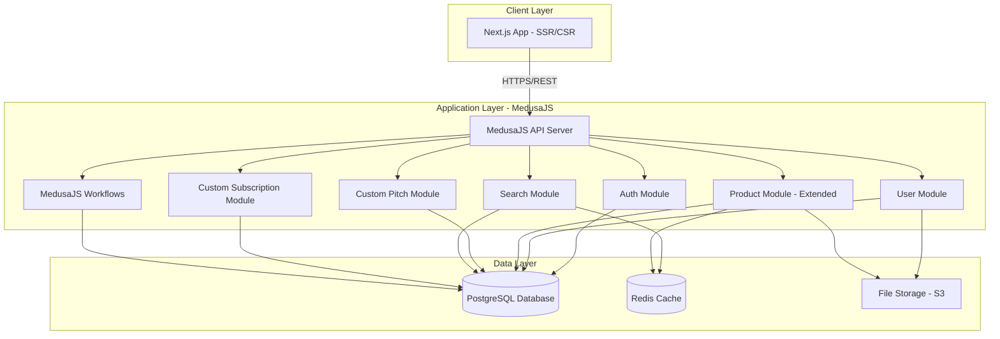

# Design Document

## Overview

Trade-Pal is a web-based B2B marketplace platform built as a modern single-page application (SPA) with a RESTful API backend. The architecture follows a three-tier pattern: presentation layer (React frontend), application layer (Node.js/Express API), and data layer (PostgreSQL database with Redis caching). The system prioritizes scalability, security, and user experience through clean separation of concerns and industry-standard patterns.

## Architecture

### High-Level Architecture



### Technology Stack

**Frontend:**

- Next.js 14+ with TypeScript and App Router
- Tailwind CSS for styling
- shadcn/ui for UI components
- React Hook Form for form management
- Zod for validation
- TanStack Query (React Query) for server state management
- Axios for API communication

**Backend:**

- MedusaJS 2.0 (Node.js-based e-commerce framework)
- TypeScript for type safety
- Built-in authentication with JWT
- PostgreSQL for relational data (MedusaJS default)
- Redis for caching and job queues (MedusaJS default)
- MedusaJS Workflows for complex business logic
- MedusaJS Admin API for management operations

**Database:**

- PostgreSQL 14+ for relational data (MedusaJS managed)
- Redis for session management, caching, and job queues
- AWS S3 or similar for file storage (product images, company logos)

**Infrastructure:**

- Docker for containerization
- Nginx as reverse proxy
- PM2 for process management

## Components and Interfaces

### 1. Authentication Module (MedusaJS Extended)

**Responsibilities:**

- User registration and login (extends MedusaJS Customer)
- JWT token generation and validation (MedusaJS built-in)
- Password hashing and verification (MedusaJS built-in)
- Session management

**Key Interfaces:**

```typescript
// Extends MedusaJS Customer entity
import { Customer } from "@medusajs/medusa";

interface ExtendedCustomer extends Customer {
  account_type: "BUYER" | "SELLER";
  company_name: string;
  metadata: {
    phone?: string;
    website?: string;
  };
}

interface RegisterDTO {
  email: string;
  password: string;
  account_type: "BUYER" | "SELLER";
  company_name: string;
  first_name: string;
  last_name: string;
  phone?: string;
}

interface LoginDTO {
  email: string;
  password: string;
}

interface AuthResponse {
  customer: ExtendedCustomer;
  // MedusaJS handles JWT tokens via cookies
}
```

### 2. User Profile Module (Custom MedusaJS Module)

**Responsibilities:**

- User profile management (Buyer and Seller)
- Company information CRUD operations
- Pseudonymization of sensitive data
- User data retrieval and updates

**Key Interfaces:**

```typescript
// Custom entity extending MedusaJS patterns
import { BaseEntity } from "@medusajs/medusa";

class UserProfile extends BaseEntity {
  customer_id: string;
  customer: ExtendedCustomer;

  business_type: string;
  description?: string;
  country: string;
  city?: string;
  address?: string;
  industry_sector?: string;
  logo_url?: string;
  ranking_score: number; // For sellers only

  metadata: Record<string, any>;
}

interface ProfileDTO {
  business_type: string;
  description?: string;
  location: Location;
  industry_sector?: string;
}

interface Location {
  country: string;
  city?: string;
  address?: string;
}

// MedusaJS Service pattern
class UserProfileService extends TransactionBaseService {
  async createProfile(
    customerId: string,
    profileData: ProfileDTO
  ): Promise<UserProfile>;
  async updateProfile(
    profileId: string,
    updates: Partial<ProfileDTO>
  ): Promise<UserProfile>;
  async getProfile(customerId: string): Promise<UserProfile>;
  async getPublicProfile(customerId: string): Promise<Partial<UserProfile>>;
  async pseudonymizeUserData(customerId: string): Promise<PseudonymizedData>;
}
```

### 3. Product Module (Extended MedusaJS Product)

**Responsibilities:**

- Product catalog management for Sellers (extends MedusaJS Product)
- Product CRUD operations
- Product image handling (MedusaJS built-in)
- Product search indexing

**Key Interfaces:**

```typescript
// Extends MedusaJS Product entity
import { Product as MedusaProduct } from "@medusajs/medusa";

interface ExtendedProduct extends MedusaProduct {
  seller_id: string;
  seller: ExtendedCustomer;
  specifications: Record<string, any>;
  minimum_order_quantity?: number;
  // MedusaJS already has: title, description, images, variants (for pricing)
}

interface ProductDTO {
  title: string;
  description: string;
  specifications: Record<string, any>;
  category_id?: string;
  minimum_order_quantity?: number;
  // Variants for pricing (MedusaJS pattern)
  variants: Array<{
    title: string;
    prices: Array<{
      amount: number;
      currency_code: string;
    }>;
    inventory_quantity: number;
  }>;
}

// MedusaJS Service pattern
class ExtendedProductService extends ProductService {
  async createProduct(
    sellerId: string,
    productData: ProductDTO
  ): Promise<ExtendedProduct>;
  async updateProduct(
    productId: string,
    updates: Partial<ProductDTO>
  ): Promise<ExtendedProduct>;
  async deleteProduct(productId: string): Promise<void>;
  async getProduct(productId: string): Promise<ExtendedProduct>;
  async getSellerProducts(
    sellerId: string,
    pagination: PaginationParams
  ): Promise<PaginatedProducts>;
}
```

### 4. Pitch Module (Custom MedusaJS Module)

**Responsibilities:**

- Pitch creation and management
- Negotiation message handling
- Proposal tracking
- Pitch status management
- Supplier relationship creation upon pitch closure

**Key Interfaces:**

```typescript
// Custom MedusaJS entities
import { BaseEntity } from "@medusajs/medusa";

class Pitch extends BaseEntity {
  buyer_id: string;
  buyer: ExtendedCustomer;

  seller_id: string;
  seller: ExtendedCustomer;

  product_id: string;
  product: ExtendedProduct;

  status: PitchStatus;
  requested_quantity: number;
  target_price_amount?: number;
  target_price_currency?: string;

  closed_at?: Date;

  messages: PitchMessage[];
  proposals: Proposal[];
}

type PitchStatus = "OPEN" | "IN_NEGOTIATION" | "CLOSED" | "CANCELLED";

// MedusaJS Service pattern
class PitchService extends TransactionBaseService {
  async createPitch(buyerId: string, pitchData: CreatePitchDTO): Promise<Pitch>;
  async getPitch(pitchId: string): Promise<PitchDetails>;
  async getBuyerPitches(buyerId: string): Promise<Pitch[]>;
  async getSellerPitches(sellerId: string): Promise<Pitch[]>;
  async addMessage(pitchId: string, message: MessageDTO): Promise<PitchMessage>;
  async submitProposal(
    pitchId: string,
    proposal: ProposalDTO
  ): Promise<Proposal>;
  async closePitch(
    pitchId: string,
    agreedTerms: AgreedTerms
  ): Promise<SupplierRelationship>;
  async updatePitchStatus(pitchId: string, status: PitchStatus): Promise<Pitch>;
}

interface CreatePitchDTO {
  sellerId: string;
  productId: string;
  initialMessage: string;
  requestedQuantity: number;
  targetPrice?: Price;
}

interface Pitch {
  id: string;
  buyerId: string;
  sellerId: string;
  productId: string;
  status: PitchStatus;
  createdAt: Date;
  updatedAt: Date;
  closedAt?: Date;
}

type PitchStatus = "OPEN" | "IN_NEGOTIATION" | "CLOSED" | "CANCELLED";

interface PitchDetails extends Pitch {
  messages: Message[];
  proposals: Proposal[];
  product: Product;
  buyer: PublicProfile;
  seller: PublicProfile;
}

interface MessageDTO {
  senderId: string;
  content: string;
}

interface Message extends MessageDTO {
  id: string;
  pitchId: string;
  createdAt: Date;
}

interface ProposalDTO {
  proposedBy: string;
  price: Price;
  quantity: number;
  terms?: string;
}

interface Proposal extends ProposalDTO {
  id: string;
  pitchId: string;
  createdAt: Date;
  status: "PENDING" | "ACCEPTED" | "REJECTED" | "SUPERSEDED";
}

interface AgreedTerms {
  finalPrice: Price;
  quantity: number;
  deliveryTerms: string;
  paymentTerms: string;
}

interface SupplierRelationship {
  id: string;
  buyerId: string;
  sellerId: string;
  pitchId: string;
  agreedTerms: AgreedTerms;
  createdAt: Date;
  transactionHistory: Transaction[];
}
```

### 5. Search Module (MedusaJS Search Plugin)

**Responsibilities:**

- Full-text search across suppliers, buyers, and products
- Filter application and result ranking
- Search result caching
- Ranking score integration

**Key Interfaces:**

```typescript
// Uses MedusaJS Search Service pattern
class ExtendedSearchService extends SearchService {
  async searchProducts(
    query: SearchQuery
  ): Promise<SearchResults<ExtendedProduct>>;
  async searchSuppliers(
    query: SearchQuery
  ): Promise<SearchResults<UserProfile>>;
  async searchBuyers(query: SearchQuery): Promise<SearchResults<UserProfile>>;
  async applyFilters(results: any[], filters: SearchFilters): Promise<any[]>;
}

interface SearchQuery {
  text: string;
  filters?: SearchFilters;
  pagination: PaginationParams;
  sortBy?: SortOption;
}

interface SearchFilters {
  category?: string[];
  location?: string[];
  priceRange?: PriceRange;
  minRankingScore?: number;
}

interface PriceRange {
  min: number;
  max: number;
  currency: string;
}

type SortOption =
  | "RELEVANCE"
  | "PRICE_ASC"
  | "PRICE_DESC"
  | "RANKING_DESC"
  | "NEWEST";

interface SearchResults<T> {
  results: T[];
  total: number;
  page: number;
  totalPages: number;
  facets?: SearchFacets;
}

interface SearchFacets {
  categories: FacetCount[];
  locations: FacetCount[];
  priceRanges: FacetCount[];
}

interface FacetCount {
  value: string;
  count: number;
}
```

### 6. Subscription Module (Custom MedusaJS Module)

**Responsibilities:**

- Subscription plan management
- User subscription tracking
- Trade deal counting
- Subscription tier eligibility
- Transaction fee calculation

**Key Interfaces:**

```typescript
// Custom MedusaJS entities
class SubscriptionPlan extends BaseEntity {
  name: string;
  price: number;
  currency: string;
  billing_period: "MONTHLY" | "YEARLY";
  features: string[];
  trade_limit?: number;
}

class Subscription extends BaseEntity {
  customer_id: string;
  customer: ExtendedCustomer;

  plan_id: string;
  plan: SubscriptionPlan;

  status: "ACTIVE" | "EXPIRED" | "CANCELLED";
  start_date: Date;
  end_date: Date;
  trade_count: number;
}

// MedusaJS Service pattern
class SubscriptionService extends TransactionBaseService {
  async getAvailablePlans(): Promise<SubscriptionPlan[]>;
  async subscribeToPlan(
    customerId: string,
    planId: string
  ): Promise<Subscription>;
  async getActiveSubscription(customerId: string): Promise<Subscription | null>;
  async checkSubscriptionAccess(customerId: string): Promise<boolean>;
  async incrementTradeCount(customerId: string): Promise<number>;
  async calculateTransactionFee(transactionAmount: number): Promise<number>;
  async recordTransaction(transaction: TransactionDTO): Promise<Transaction>;
}

interface SubscriptionPlan {
  id: string;
  name: string;
  price: number;
  currency: string;
  billingPeriod: "MONTHLY" | "YEARLY";
  features: string[];
  tradeLimit?: number;
}

interface Subscription {
  id: string;
  userId: string;
  planId: string;
  status: "ACTIVE" | "EXPIRED" | "CANCELLED";
  startDate: Date;
  endDate: Date;
  tradeCount: number;
}

interface TransactionDTO {
  buyerId: string;
  sellerId: string;
  pitchId: string;
  amount: number;
  currency: string;
}

interface Transaction extends TransactionDTO {
  id: string;
  transactionFee: number;
  status: "PENDING" | "COMPLETED" | "FAILED";
  createdAt: Date;
  completedAt?: Date;
}
```

## Data Models

### Database Schema

```sql
-- Users table
CREATE TABLE users (
    id UUID PRIMARY KEY DEFAULT gen_random_uuid(),
    email VARCHAR(255) UNIQUE NOT NULL,
    password_hash VARCHAR(255) NOT NULL,
    account_type VARCHAR(20) NOT NULL CHECK (account_type IN ('BUYER', 'SELLER')),
    created_at TIMESTAMP DEFAULT CURRENT_TIMESTAMP,
    updated_at TIMESTAMP DEFAULT CURRENT_TIMESTAMP,
    last_login TIMESTAMP
);

-- Profiles table
CREATE TABLE profiles (
    id UUID PRIMARY KEY DEFAULT gen_random_uuid(),
    user_id UUID REFERENCES users(id) ON DELETE CASCADE,
    company_name VARCHAR(255) NOT NULL,
    business_type VARCHAR(100),
    description TEXT,
    country VARCHAR(100),
    city VARCHAR(100),
    address TEXT,
    industry_sector VARCHAR(100),
    phone VARCHAR(50),
    contact_email VARCHAR(255),
    website VARCHAR(255),
    logo_url VARCHAR(500),
    ranking_score DECIMAL(3,2) DEFAULT 0.00,
    created_at TIMESTAMP DEFAULT CURRENT_TIMESTAMP,
    updated_at TIMESTAMP DEFAULT CURRENT_TIMESTAMP
);

-- Products table
CREATE TABLE products (
    id UUID PRIMARY KEY DEFAULT gen_random_uuid(),
    seller_id UUID REFERENCES users(id) ON DELETE CASCADE,
    name VARCHAR(255) NOT NULL,
    description TEXT,
    specifications JSONB,
    price_amount DECIMAL(15,2) NOT NULL,
    price_currency VARCHAR(10) NOT NULL,
    price_unit VARCHAR(50),
    category VARCHAR(100),
    minimum_order_quantity INTEGER,
    status VARCHAR(20) DEFAULT 'ACTIVE' CHECK (status IN ('ACTIVE', 'INACTIVE')),
    created_at TIMESTAMP DEFAULT CURRENT_TIMESTAMP,
    updated_at TIMESTAMP DEFAULT CURRENT_TIMESTAMP
);

-- Product images table
CREATE TABLE product_images (
    id UUID PRIMARY KEY DEFAULT gen_random_uuid(),
    product_id UUID REFERENCES products(id) ON DELETE CASCADE,
    image_url VARCHAR(500) NOT NULL,
    display_order INTEGER DEFAULT 0,
    created_at TIMESTAMP DEFAULT CURRENT_TIMESTAMP
);

-- Pitches table
CREATE TABLE pitches (
    id UUID PRIMARY KEY DEFAULT gen_random_uuid(),
    buyer_id UUID REFERENCES users(id) ON DELETE CASCADE,
    seller_id UUID REFERENCES users(id) ON DELETE CASCADE,
    product_id UUID REFERENCES products(id) ON DELETE SET NULL,
    status VARCHAR(20) DEFAULT 'OPEN' CHECK (status IN ('OPEN', 'IN_NEGOTIATION', 'CLOSED', 'CANCELLED')),
    requested_quantity INTEGER,
    target_price_amount DECIMAL(15,2),
    target_price_currency VARCHAR(10),
    created_at TIMESTAMP DEFAULT CURRENT_TIMESTAMP,
    updated_at TIMESTAMP DEFAULT CURRENT_TIMESTAMP,
    closed_at TIMESTAMP
);

-- Pitch messages table
CREATE TABLE pitch_messages (
    id UUID PRIMARY KEY DEFAULT gen_random_uuid(),
    pitch_id UUID REFERENCES pitches(id) ON DELETE CASCADE,
    sender_id UUID REFERENCES users(id) ON DELETE CASCADE,
    content TEXT NOT NULL,
    created_at TIMESTAMP DEFAULT CURRENT_TIMESTAMP
);

-- Proposals table
CREATE TABLE proposals (
    id UUID PRIMARY KEY DEFAULT gen_random_uuid(),
    pitch_id UUID REFERENCES pitches(id) ON DELETE CASCADE,
    proposed_by UUID REFERENCES users(id) ON DELETE CASCADE,
    price_amount DECIMAL(15,2) NOT NULL,
    price_currency VARCHAR(10) NOT NULL,
    quantity INTEGER NOT NULL,
    terms TEXT,
    status VARCHAR(20) DEFAULT 'PENDING' CHECK (status IN ('PENDING', 'ACCEPTED', 'REJECTED', 'SUPERSEDED')),
    created_at TIMESTAMP DEFAULT CURRENT_TIMESTAMP
);

-- Supplier relationships table
CREATE TABLE supplier_relationships (
    id UUID PRIMARY KEY DEFAULT gen_random_uuid(),
    buyer_id UUID REFERENCES users(id) ON DELETE CASCADE,
    seller_id UUID REFERENCES users(id) ON DELETE CASCADE,
    pitch_id UUID REFERENCES pitches(id) ON DELETE SET NULL,
    agreed_price_amount DECIMAL(15,2),
    agreed_price_currency VARCHAR(10),
    agreed_quantity INTEGER,
    delivery_terms TEXT,
    payment_terms TEXT,
    created_at TIMESTAMP DEFAULT CURRENT_TIMESTAMP
);

-- Subscription plans table
CREATE TABLE subscription_plans (
    id UUID PRIMARY KEY DEFAULT gen_random_uuid(),
    name VARCHAR(100) NOT NULL,
    price DECIMAL(10,2) NOT NULL,
    currency VARCHAR(10) NOT NULL,
    billing_period VARCHAR(20) NOT NULL,
    features JSONB,
    trade_limit INTEGER,
    created_at TIMESTAMP DEFAULT CURRENT_TIMESTAMP
);

-- Subscriptions table
CREATE TABLE subscriptions (
    id UUID PRIMARY KEY DEFAULT gen_random_uuid(),
    user_id UUID REFERENCES users(id) ON DELETE CASCADE,
    plan_id UUID REFERENCES subscription_plans(id),
    status VARCHAR(20) DEFAULT 'ACTIVE' CHECK (status IN ('ACTIVE', 'EXPIRED', 'CANCELLED')),
    start_date TIMESTAMP NOT NULL,
    end_date TIMESTAMP NOT NULL,
    trade_count INTEGER DEFAULT 0,
    created_at TIMESTAMP DEFAULT CURRENT_TIMESTAMP
);

-- Transactions table
CREATE TABLE transactions (
    id UUID PRIMARY KEY DEFAULT gen_random_uuid(),
    buyer_id UUID REFERENCES users(id) ON DELETE CASCADE,
    seller_id UUID REFERENCES users(id) ON DELETE CASCADE,
    pitch_id UUID REFERENCES pitches(id) ON DELETE SET NULL,
    amount DECIMAL(15,2) NOT NULL,
    currency VARCHAR(10) NOT NULL,
    transaction_fee DECIMAL(15,2) NOT NULL,
    status VARCHAR(20) DEFAULT 'PENDING' CHECK (status IN ('PENDING', 'COMPLETED', 'FAILED')),
    created_at TIMESTAMP DEFAULT CURRENT_TIMESTAMP,
    completed_at TIMESTAMP
);

-- Pseudonymization mapping table (restricted access)
CREATE TABLE pseudonym_mappings (
    id UUID PRIMARY KEY DEFAULT gen_random_uuid(),
    user_id UUID REFERENCES users(id) ON DELETE CASCADE,
    pseudonym_id VARCHAR(255) UNIQUE NOT NULL,
    created_at TIMESTAMP DEFAULT CURRENT_TIMESTAMP
);

-- Indexes for performance
CREATE INDEX idx_users_email ON users(email);
CREATE INDEX idx_profiles_user_id ON profiles(user_id);
CREATE INDEX idx_products_seller_id ON products(seller_id);
CREATE INDEX idx_products_category ON products(category);
CREATE INDEX idx_pitches_buyer_id ON pitches(buyer_id);
CREATE INDEX idx_pitches_seller_id ON pitches(seller_id);
CREATE INDEX idx_pitches_status ON pitches(status);
CREATE INDEX idx_pitch_messages_pitch_id ON pitch_messages(pitch_id);
CREATE INDEX idx_proposals_pitch_id ON proposals(pitch_id);
CREATE INDEX idx_supplier_relationships_buyer_id ON supplier_relationships(buyer_id);
CREATE INDEX idx_subscriptions_user_id ON subscriptions(user_id);
CREATE INDEX idx_transactions_buyer_id ON transactions(buyer_id);
CREATE INDEX idx_transactions_seller_id ON transactions(seller_id);
```

## Error Handling

### Error Response Format

All API errors follow a consistent format:

```typescript
interface ErrorResponse {
  error: {
    code: string;
    message: string;
    details?: any;
    timestamp: string;
    path: string;
  };
}
```

### Error Categories

1. **Authentication Errors (401)**
   - INVALID_CREDENTIALS
   - TOKEN_EXPIRED
   - TOKEN_INVALID
   - UNAUTHORIZED_ACCESS

2. **Authorization Errors (403)**
   - INSUFFICIENT_PERMISSIONS
   - SUBSCRIPTION_REQUIRED
   - ACCOUNT_TYPE_MISMATCH

3. **Validation Errors (400)**
   - INVALID_INPUT
   - MISSING_REQUIRED_FIELD
   - INVALID_FORMAT

4. **Resource Errors (404)**
   - USER_NOT_FOUND
   - PRODUCT_NOT_FOUND
   - PITCH_NOT_FOUND

5. **Business Logic Errors (422)**
   - PITCH_ALREADY_CLOSED
   - INSUFFICIENT_TRADE_LIMIT
   - DUPLICATE_PROPOSAL

6. **Server Errors (500)**
   - INTERNAL_SERVER_ERROR
   - DATABASE_ERROR
   - EXTERNAL_SERVICE_ERROR

### Error Handling Strategy

```typescript
// Centralized error handler middleware
class ErrorHandler {
  static handle(error: Error, req: Request, res: Response, next: NextFunction) {
    if (error instanceof ValidationError) {
      return res.status(400).json({
        error: {
          code: "INVALID_INPUT",
          message: error.message,
          details: error.details,
          timestamp: new Date().toISOString(),
          path: req.path,
        },
      });
    }

    if (error instanceof AuthenticationError) {
      return res.status(401).json({
        error: {
          code: error.code,
          message: error.message,
          timestamp: new Date().toISOString(),
          path: req.path,
        },
      });
    }

    // Log unexpected errors
    logger.error("Unexpected error:", error);

    return res.status(500).json({
      error: {
        code: "INTERNAL_SERVER_ERROR",
        message: "An unexpected error occurred",
        timestamp: new Date().toISOString(),
        path: req.path,
      },
    });
  }
}
```

## Testing Strategy

### Unit Testing

**Scope:** Individual functions, methods, and components in isolation

**Tools:** Jest, React Testing Library

**Coverage Targets:**

- Service layer: 90%+ coverage
- Utility functions: 95%+ coverage
- React components: 80%+ coverage

**Key Areas:**

- Authentication logic (password hashing, token generation)
- Business logic (ranking score calculation, transaction fee calculation)
- Data validation and transformation
- React component rendering and user interactions

### Integration Testing

**Scope:** API endpoints and service interactions

**Tools:** Jest, Supertest

**Coverage:**

- All API endpoints with various input scenarios
- Database operations and transactions
- Service-to-service communication
- Authentication and authorization flows

**Key Test Scenarios:**

- Complete user registration and login flow
- Product creation and search workflow
- Pitch creation, negotiation, and closure
- Subscription activation and trade counting

### End-to-End Testing

**Scope:** Complete user workflows from UI to database

**Tools:** Playwright or Cypress

**Key User Journeys:**

1. Buyer registration → profile creation → product search → pitch creation
2. Seller registration → profile creation → product listing → pitch response
3. Complete negotiation flow → pitch closure → supplier relationship creation
4. Subscription selection → trade execution → transaction fee recording

### API Testing

**Documentation:** OpenAPI/Swagger specification

**Testing Approach:**

- Contract testing for API endpoints
- Request/response validation
- Error scenario coverage
- Performance and load testing for critical endpoints

### Security Testing

**Focus Areas:**

- SQL injection prevention
- XSS protection
- CSRF token validation
- JWT token security
- Password strength requirements
- Rate limiting effectiveness
- Data pseudonymization verification

### Performance Testing

**Metrics:**

- API response time < 200ms for 95th percentile
- Search query response < 500ms
- Database query optimization
- Caching effectiveness
- Concurrent user handling (target: 1000+ simultaneous users)

## Security Considerations

### Authentication & Authorization

- JWT tokens with 15-minute access token expiry
- Refresh tokens with 7-day expiry
- Secure HTTP-only cookies for token storage
- Role-based access control (RBAC) for Buyer/Seller permissions

### Data Protection

- HTTPS/TLS encryption for all communications
- Bcrypt password hashing with salt rounds = 12
- Pseudonymization of PII in logs and analytics
- Database encryption at rest
- Secure file upload validation (file type, size limits)

### API Security

- Rate limiting: 100 requests per minute per IP
- Input validation and sanitization
- CORS configuration for allowed origins
- SQL injection prevention via parameterized queries
- XSS protection via content security policy

### Compliance

- GDPR compliance for EU users
- Data retention policies
- User data export and deletion capabilities
- Audit logging for sensitive operations
